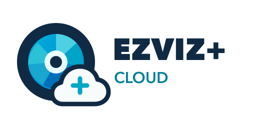

  <picture>
    <source media="(prefers-color-scheme: dark)" srcset="custom_components/ezviz_plus/brand/dark_logo@2x.png">
    <source media="(prefers-color-scheme: light)" srcset="custom_components/ezviz_plus/brand/logo@2x.png">
    
  </picture>

<h1 align="center">EZVIZ Cloud Plus</h1>

  

EZVIZ Cloud Plus is a custom Home Assistant integration for EZVIZ cameras. It
combines EZVIZ Cloud access, local RTSP streaming, MQTT events, SD-card
recording playback, and camera controls in one config entry.

The integration is backed by
[adirgan/pyEzvizApi](https://github.com/adirgan/pyEzvizApi) and is designed to
coexist with the official `ezviz` integration and other custom EZVIZ
integrations.

> [!IMPORTANT]
> This project is under active development and does not have a stable release
> yet. Install it from the `main` branch only for testing.

Current integration version: **0.2.0**. The validated minimum Home Assistant
version is **2026.7.2**. See the [changelog](CHANGELOG.md) for release details.

## Highlights

| Capability                 | What it provides                                                                                               |
| -------------------------- | -------------------------------------------------------------------------------------------------------------- |
| Local and cloud live video | Use direct RTSP when available or stream through EZVIZ Cloud                                                   |
| Automatic media routing    | Prefer the local camera and fall back to the cloud for images and live video                                   |
| Cloud snapshots            | Download and decrypt current camera images when local access is unavailable                                    |
| SD-card recordings         | Search and play camera SD recordings from Home Assistant's Media Browser                                       |
| Recent alarms              | Browse recent motion/alarm images per camera in Media Browser                                                  |
| Per-camera alarm control   | Arm or disarm motion detection and EZVIZ app notifications independently for each camera                       |
| Advanced battery telemetry | Battery percentage, charging state, charging source, and active-charging status                                |
| Battery work modes         | Classic and AOV work modes selected from each camera's advertised capabilities                                 |
| Camera controls            | Motion detection, privacy, tracking, lights, siren, PTZ, detection settings, and other model-specific features |
| Cloud events               | MQTT alarm and motion events merged into Home Assistant entities                                               |
| Device maintenance         | Firmware information, reboot controls, diagnostics, and connectivity sensors where supported                   |

EZVIZ models expose different capability sets. Home Assistant only creates a
control when the camera advertises the corresponding feature, so the exact
entity list varies by model and firmware.

## Media and streaming

Each camera can use a different source for its current image and live stream:

- **Automatic** prefers local RTSP and falls back to EZVIZ Cloud.
- **Local** uses a direct RTSP connection to the camera.
- **Cloud** works remotely through the EZVIZ account and does not require Home
  Assistant to reach the camera's local IP address.

Cloud streaming accepts H.264 and HEVC camera video. Compatible streams are
remuxed without re-encoding; HEVC is converted to browser-compatible H.264 when
required. FFmpeg is supplied through Home Assistant's `ffmpeg` integration.

### SD-card playback and recent alarms

Open **Media -> EZVIZ Cloud Plus**, then select a camera. The camera directory
contains:

- **Recent alarms** for cloud motion/alarm images.
- **SD recordings - last hour**.
- **SD recordings - today**.
- **SD recordings - last 7 days**.

Recording searches run against the SD card in the camera. Selected recordings
are downloaded through EZVIZ playback and remuxed to fragmented MP4 for browser
playback. Availability depends on camera, account, firmware, and SD-card
support; this is not a cloud-recording subscription browser.

## Individual camera arming

Supported cameras receive their own `alarm_control_panel` entity in addition to
the account-level EZVIZ alarm:

- **Arm away** enables motion detection and the corresponding EZVIZ app alarm
  notifications for that camera.
- **Disarm** disables them for that camera only.

The existing motion-detection switch remains available and reflects the same
per-camera state. Arming one camera does not arm or disarm the other cameras on
the account.

## Battery cameras

Supported battery cameras can expose:

- Battery percentage.
- Charge state, including charging, full, not charging, and fault states.
- Active-charging binary status.
- Charging source, such as power adapter or solar.
- A model-appropriate battery work-mode selector.

Newer cameras advertising AOV capabilities receive the AOV work modes
**Standard**, **Plugged in**, **Super power saving**, **Custom**, and **AOV
mode**. Other compatible cameras retain the classic work-mode choices.

## Install with HACS

This repository is not yet included in the default HACS catalog. Add it as a
custom repository:

1. Open **HACS** in Home Assistant.
2. Open the three-dot menu in the top-right corner and select
   **Custom repositories**.
3. Enter `https://github.com/adirgan/ha-ezviz-cloud-plus` as the repository URL.
4. Select **Integration** as the category and click **Add**.
5. Open **EZVIZ Cloud Plus** in HACS and select **Download**.
6. Select the `main` version when prompted, then complete the download.
7. Restart Home Assistant.
8. Open **Settings -> Devices & services -> Add integration**, search for
   **EZVIZ Cloud Plus**, and complete the EZVIZ login flow.

HACS installs the integration under `custom_components/ezviz_plus`. A Home
Assistant restart is required after the first installation and after updates.

## EZVIZ account setup

1. [Register an EZVIZ account](https://i.ezvizlife.com/user/userAction!goRegister.action).
2. Keep your EZVIZ username available for the Home Assistant setup flow.
3. Confirm that you can [sign in to EZVIZ](https://euauth.ezvizlife.com/signIn).
4. Add and manage cameras in the EZVIZ app before adding the integration.

## Configuration and options

The integration logs into **EZVIZ Cloud**, subscribes to **MQTT** events, and
stores media and credential settings independently for every camera.

> **Heads up:** As of v4, all per-camera settings live under the cloud entry’s **Options**. Legacy per-camera entries are migrated automatically.

## Add the integration

1. Open **Settings -> Devices & services -> Add integration -> EZVIZ Cloud
   Plus**.
2. Sign in with your EZVIZ account.
3. If EZVIZ requests a one-time 2FA, follow the prompt.
4. On success, the cloud tokens are stored; entities and MQTT will load.

## Configure per-camera options

Open **Settings -> Devices & services -> EZVIZ Cloud Plus -> Configure**, choose
**Camera Settings**, and select a camera. The options are divided into three
areas:

- **Media source preferences** selects Automatic, Local, or Cloud access for
  current images and live video.
- **Cloud images** stores or retrieves the encryption key used for encrypted
  cloud media.
- **Local live video (RTSP)** configures direct camera credentials and the RTSP
  path.

For local RTSP configuration, you will see the following fields:

### Fields

- **Camera Username**  
  The local username used for RTSP on the device (often `admin`, or
  model-specific).

- **RTSP Path**  
  The path part of the RTSP URL.  
  **Default:** `/Streaming/Channels/102` (the **sub-stream**)  
  Common values:
  - `/Streaming/Channels/101` for the main stream.
  - `/Streaming/Channels/102` for the lower-bitrate sub-stream (default).
  - NVRs typically follow the same pattern per channel.

- **Use Verification Code (VC) for RTSP** _(toggle)_
  Switch RTSP authentication between:
  - **VC mode** (uses the **Verification Code**)
  - **ENC mode** (uses the **Encryption Key**)

- **Verification Code**  
  The **sticker/verification code** printed on the camera/NVR. Present on all devices.

- **Encryption Key**  
  The device **Encryption Key** (used when encryption is **enabled** on the device).

  > Encryption can be **disabled** on the device. If disabled, you can leave this as “fetch_my_key” or blank and use VC mode instead.

- **Validate credentials now** _(checkbox)_
  One-time RTSP validation. When checked, the form will **test** the RTSP credentials before saving.  
  This does **not** store anything by itself; it only validates the values you entered.

> **Tip:** If you don’t know the VC or ENC, keep the default **`fetch_my_key`** value. The integration will fetch it from EZVIZ (you may be prompted for a one-time 2FA).

### What gets saved

- Per-camera settings are stored under the cloud entry’s **Options**.
- The **RTSP Path**, **auth mode** (VC vs ENC), and whichever secret you used (VC or ENC) are saved per camera.
- The **Validate** checkbox is **not** saved; it only runs a one-time check at submit time.

## How VC vs ENC works

- **Verification Code (VC)**  
  Always present (printed on a sticker). When **VC mode** is enabled, the RTSP password is the **verification code**.

- **Encryption Key (ENC)**  
  Only relevant if **Encryption** is **enabled** on the device. When **VC mode** is **off**, RTSP uses the **encryption key**.

- **Encryption disabled?**  
  Then ENC may be unnecessary; use **VC mode** for RTSP.

You can switch modes at any time with the toggle. After you save, entities reload to use the new settings.

## One-time 2FA during edit

When fetching VC or ENC from the cloud (because you left `fetch_my_key`), EZVIZ may require a **one-time 2FA**:

1. You’ll be prompted for a **Verification Code 2FA** (for VC fetch) or **Encryption Key 2FA** (for ENC fetch).
2. Enter the code you received; the integration fetches the value and returns to the edit form **prefilled** with the resolved secret.
3. Click **Submit** to save.

If validation fails (auth or connectivity), the form reopens with the **best-known values** so you can adjust and try again.

## Examples

**Typical main stream RTSP URL (VC mode):**
`rtsp://<username>:<verification_code>@<camera-ip>:554/Streaming/Channels/101`

**Typical sub-stream RTSP URL (ENC mode):**
`rtsp://<username>:<encryption_key>@<camera-ip>:554/Streaming/Channels/102`

> Only the **path** (`/Streaming/Channels/101` or `/Streaming/Channels/102`) is configured in Options; the integration composes the full URL for you.

## Troubleshooting

- **RTSP validation failed**
  - Check the **auth mode** (VC vs ENC) matches what the device expects.
  - Verify the **RTSP Path** (try `/Streaming/Channels/101` for main or `/Streaming/Channels/102` for sub).
  - Ensure Home Assistant can reach the camera’s IP: `rtsp://<camera-ip>:554`.

- **Keeps asking for 2FA**
  - Codes expire quickly; request a new code and enter it promptly.
  - Make sure you’re entering the code for the **action** you’re performing (VC fetch vs ENC fetch).

- **No events/updates**
  - Confirm the cloud login is still valid (reconfigure if needed).
  - Reboot the camera/NVR if RTSP/MQTT seems stuck.

- **Cloud live stream does not start**
  - Confirm **Live stream** is set to **Automatic** or **Cloud** in the camera's
    media source preferences.
  - Configure the camera encryption key when encrypted media is enabled.
  - Check the Home Assistant log for EZVIZ cloud-stream or FFmpeg errors.

- **The SD recording folder is empty**
  - Confirm the camera has an SD card and that recording is enabled in EZVIZ.
  - Try a wider window such as **today** or **last 7 days**.
  - SD search and playback availability varies by camera firmware and account
    region.

- **The camera alarm control is missing**
  - The camera must advertise individual defence support to EZVIZ Cloud.
  - Reload the integration after a camera firmware or capability change.

- **Arm/disarm state takes time to settle**
  - The command is applied immediately in Home Assistant, then reconciled with
    the next EZVIZ coordinator update.

## Security and privacy

- EZVIZ account tokens and per-camera credentials are stored in Home
  Assistant's config entry and options storage.
- Do not include diagnostics containing identifiers or credentials in public
  issue reports without reviewing them first.
- Local RTSP keeps live video on the local network after authentication. Cloud
  images, cloud live video, events, and SD playback communicate with EZVIZ.
- Media playback endpoints created by the integration use unguessable local
  access tokens and are not intended to be exposed directly.

---

## Migration (v4)

- Legacy per-camera config entries are merged into the cloud entry’s **Options**.
- Ignored legacy entries (`version < 4`) are cleaned up automatically.
- Entity identifiers are preserved.
